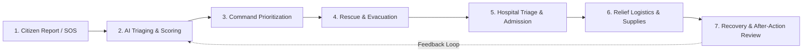
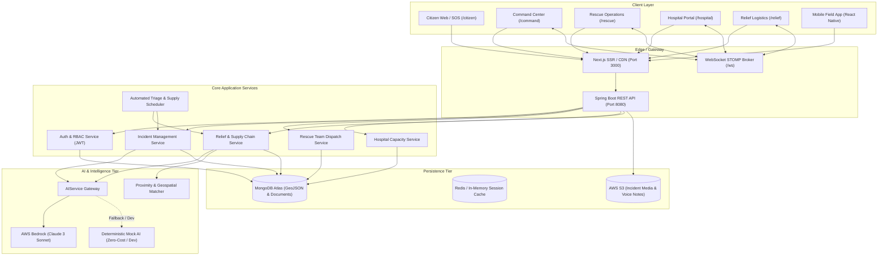

# AI Emergency Response & Relief Network (ADRN) — Architecture

## 1. Executive Summary

The **AI Emergency Response & Relief Network (ADRN)** is a unified, mission-critical disaster management and humanitarian logistics platform. It bridges the critical operational gap between initial emergency response (search, rescue, evacuation, and hospitalization) and post-incident humanitarian relief (food distribution, clean water supply, emergency shelter, and medical kit replenishment).

By unifying citizens, first responders, medical facilities, relief agencies, and command staff into an AI-coordinated network, ADRN minimizes response latency and eliminates aid supply bottlenecks during crises.

---

## 2. End-to-End Disaster Lifecycle

ADRN models and orchestrates the complete disaster lifecycle across six continuous operational stages:

1. **Report**: Multichannel citizen reporting via SOS alerts, voice memos, photo evidence, and WhatsApp/SMS integration with automatic geocoding.
2. **Analyze**: AI Triaging Engine processes natural language across Sinhala, Tamil, and English, determines threat severity (P1 Critical to P4 Minor), extracts casualties, and identifies resource requirements (medical, rescue boats, food packs, water purification).
3. **Prioritize**: Command Center visualizes heatmaps, digital twins, and active incidents, automatically assigning priority tiers.
4. **Rescue**: Tactical dispatch of closest available rescue units with live GPS tracking and waypoint telemetry.
5. **Hospitalize**: Real-time hospital capacity monitoring (ICU beds, ventilators, blood bank, trauma units) and dynamic ambulance diversion to prevent facility overload.
6. **Relief Logistics**: Automated matching of affected shelters and community camps with registered relief hubs, community kitchens, water distribution points, and warehouses, creating managed delivery missions.
7. **Recovery**: Continuous monitoring of ration shelf-life, supply consumption rates, and automated generation of incident After-Action Reports (AAR).

---

## 3. System Architecture Overview

---

## 4. Key Subsystems & Data Flows

### 4.1. Multilingual AI Triaging Engine
- **Supported Languages**: English, Tamil, Sinhala.
- **Extraction Targets**:
  - Hazard Type (`FLOOD`, `EARTHQUAKE`, `FIRE`, `LANDSLIDE`, `MEDICAL_EMERGENCY`, `FOOD_WATER_CRISIS`).
  - Severity Rating (`CRITICAL_P1`, `HIGH_P2`, `MEDIUM_P3`, `LOW_P4`).
  - Estimated People Affected / Casualties.
  - Urgency Score (0 to 100).
  - Recommended Resource Allocations (e.g., 200 food packs, 500L clean water, 2 rescue boats).
- **Graceful Fallback**: If AWS Bedrock credentials or network calls fail, the system falls back to `MockAIService` with 100% deterministic heuristic scoring and pattern matching.

### 4.2. Relief Logistics & Supply Chain Matching
- **Food Sources & Hubs**: Categorized by type (`COMMUNITY_KITCHEN`, `RELIEF_CAMP`, `FOOD_BANK`, `WAREHOUSE`, `RESTAURANT_DONOR`, `WATER_DISTRIBUTION`).
- **Inventory Tracking**: Meals, water liters, dry ration kits, baby formula, medical kits with expiry dates and spoilage alert flags.
- **Relief Requests**: Created automatically when incidents specify food/water needs, or manually by field officers.
- **AI Recommendation Engine**: Calculates the optimal food source using:
  $$\text{Score} = w_1 \cdot \text{Distance}^{-1} + w_2 \cdot \text{CapacityRatio} + w_3 \cdot \text{Reliability} - w_4 \cdot \text{ExpiryRisk}$$
- **Missions**: Tracked through lifecycle: `DISPATCHED` $\rightarrow$ `IN_TRANSIT` $\rightarrow$ `DELIVERED` with live coordinate updates and remaining inventory reconciliation.

### 4.3. Real-Time WebSocket Infrastructure
- **Broker Endpoint**: `/ws` (SockJS + STOMP).
- **Key Channels**:
  - `/topic/incidents`: Real-time incident reports, status transitions, and severity escalations.
  - `/topic/teams`: Responders' live GPS telemetry and availability.
  - `/topic/hospitals`: Dynamic bed and blood availability.
  - `/topic/relief-missions`: Live delivery tracking, route progress, and status changes.
  - `/topic/alerts`: Broadcast civilian evacuation orders and urgent alerts.

---

## 5. Security & RBAC Matrix

| Role | Citizen Portal | Command Center | Rescue Ops | Hospital Portal | Relief Logistics |
| :--- | :---: | :---: | :---: | :---: | :---: |
| **CITIZEN** | Full Access (SOS) | No | No | No | Request View |
| **RESCUE_TEAM** | SOS Reporting | View Only | Full Access | No | Assigned Missions |
| **HOSPITAL** | SOS Reporting | View Only | Patient Intake | Full Access | Medical Supplies |
| **OFFICER** | SOS Reporting | Full Access | Dispatch / Escalation | Read / Coordinate | Full Management |
| **ADMIN** | Full Access | Full Access | Full Access | Full Access | Full Access |

All API endpoints are protected by stateless JWT Bearer token authentication verified via Spring Security filters.
